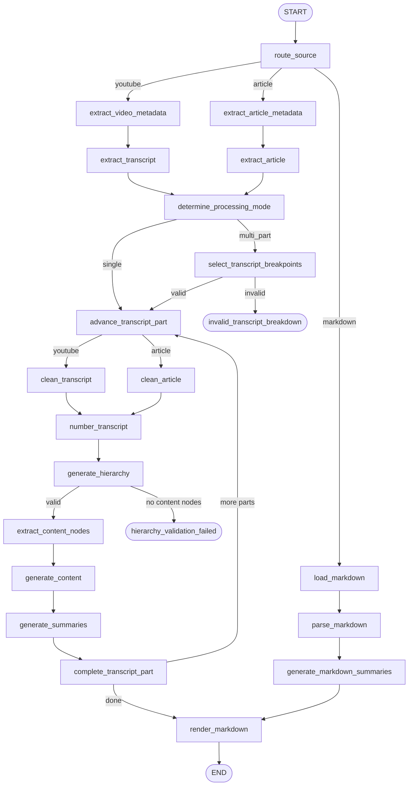

<div align="center">

# Deep Notes AI

An AI-powered knowledge processing pipeline that transforms long-form educational content into clean, structured, reusable markdown notes.


</div>

---

## What This Is

Most long-form content — YouTube lectures, technical articles, markdown documents — is consumed once and forgotten. The raw text is noisy, unstructured, and difficult to reuse.

**deep-notes-ai** solves this by running source content through a deterministic, multi-stage LangGraph pipeline that:

1. Extracts clean text from the source (stripping ads, auto-caption noise, boilerplate).
2. Numbers and structures each content point.
3. Uses an LLM to reconstruct the topic hierarchy of the document.
4. Assigns every leaf node a unique, stable UUID.
5. Generates structured markdown for each content node independently.
6. Generates concise summaries for each content node independently.
7. Merges all parts and renders three final output files: `content.md`, `summary.md`, and `README.md`.

The pipeline is **source-agnostic** after ingestion. Every source type is converted to a common internal representation (`ChapterTranscript` objects + `ContentMetadata`) before the shared processing stages begin.

This is **not** a chatbot, RAG application, or agent framework. It is a batch knowledge-processing pipeline.

---

## Features

**Source Ingestion**

- YouTube videos: metadata via `yt-dlp`, transcripts via `youtube-transcript-api`, timestamp chapter detection from native metadata and description fallback
- Web articles: HTML download via `httpx`, boilerplate removal via `trafilatura`, section extraction into chapter transcripts
- Markdown files: loaded from local `.md` files or remote HTTP(S) URLs, parsed into node hierarchy directly

**Pipeline Processing**

- LLM-based content cleaning with configurable chunk size and overlap
- Deterministic point numbering for stable content addressing
- LLM-based topic hierarchy generation with structured output (Pydantic validation)
- UUID-keyed content store for reliable cross-stage identity
- Gap-filling algorithm ensures no transcript points are lost between content nodes
- Independent per-node content structuring and summarization
- Multi-part processing for transcripts exceeding token limits, with interactive user-guided breakpoint selection

**Outputs**

- `content.md`: full structured notes preserving the topic hierarchy
- `summary.md`: condensed summary notes in the same structure
- `README.md`: metadata index with table of contents linking to the above files

**Observability**

- Per-call LLM monitoring with token counts, durations, and estimated cost
- Aggregated reports saved as `llm_usage.json` and `llm_usage.md` per run
- Structured (JSON) or human-readable log output, configurable per run
- Real-time progress events forwarded to pluggable reporters (default: console)

**Reliability**

- Configurable retry logic for LLM calls
- SQLite or in-memory checkpointing via LangGraph (resume after interruption)
- Typed exception hierarchy covering every failure mode
- Crash logs saved to `pipeline_crash_logs/` on unhandled errors

---

## Architecture Overview

The pipeline is built as a LangGraph `StateGraph`. All nodes share a single `PipelineState` typed dict. Nodes return partial state updates; they never mutate state in place.



### Source Branching

After `route_source` validates the source type and resolves the output directory, the graph branches into three independent ingestion paths. Each path eventually produces `ChapterTranscript` objects and a `ContentMetadata` object, at which point the path converges and all remaining nodes are identical.

| Path | Ingestion Nodes |
| --- | --- |
| YouTube | `extract_video_metadata` → `extract_transcript` |
| Article | `extract_article_metadata` → `extract_article` |
| Markdown | `load_markdown` → `parse_markdown` → `generate_markdown_summaries` → `render_markdown` |

The Markdown path is shorter: because the document already has structure, it skips transcript cleaning and hierarchy generation entirely.

---

## Supported Sources

| Source Type | `--source-type` value | Source format |
| --- | --- | --- |
| YouTube video | `youtube` | YouTube URL (any supported format) or raw video ID |
| Web article | `article` | HTTP(S) URL to an HTML page |
| Markdown file | `markdown` | Local `.md` file path or HTTP(S) URL to a `.md` file |

---

## Installation

**Prerequisites:** Python 3.12 or later. [uv](https://github.com/astral-sh/uv) is recommended.

```bash
# Clone the repository
git clone https://github.com/govindp47/deep-notes-ai.git
cd deep-notes-ai

# Install with uv (reads pyproject.toml and uv.lock)
uv sync

# Or install with pip
pip install -r requirements.txt
```

**Development dependencies** (pytest, pytest-cov, pytest-mock):

```bash
uv sync --group dev
```

---

## Configuration

All configuration is loaded from environment variables or a `.env` file. Copy the example file and fill in the required values:

```bash
cp .env.example .env
```

### Required

| Variable | Description |
|---|---|
| `OPENAI_API_KEY` | OpenAI API key. Required unless all pipeline stages use NVIDIA. |

### LLM Providers

Two providers are supported: `openai` and `nvidia`. Each processing stage can be configured independently.

| Variable | Default | Description |
|---|---|---|
| `NVIDIA_API_KEY` | _(empty)_ | NVIDIA NIM API key. Required when any stage uses `nvidia`. |

### Per-Stage Model Configuration

Each stage exposes three variables: `*_MODEL_PROVIDER`, `*_MODEL_NAME`, and `*_MODEL_TEMPERATURE`.

| Stage | Provider variable | Model variable | Default model |
| --- | --- | --- | --- |
| Transcript cleaning | `TRANSCRIPT_CLEANING_MODEL_PROVIDER` | `TRANSCRIPT_CLEANING_MODEL_NAME` | `gpt-4o-mini` |
| Article cleaning | `ARTICLE_CLEANING_MODEL_PROVIDER` | `ARTICLE_CLEANING_MODEL_NAME` | `gpt-5-mini` |
| Hierarchy generation | `HIERARCHY_MODEL_PROVIDER` | `HIERARCHY_MODEL_NAME` | `gpt-5-mini` |
| Content structuring | `CONTENT_MODEL_PROVIDER` | `CONTENT_MODEL_NAME` | `gpt-5-mini` |
| Summary generation | `SUMMARY_MODEL_PROVIDER` | `SUMMARY_MODEL_NAME` | `gpt-4o-mini` |

### Multi-Part Processing

| Variable | Default | Description |
|---|---|---|
| `TRANSCRIPT_MAX_TOKENS_PER_PART` | `50000` | Token limit per processing part. Transcripts exceeding this trigger interactive breakpoint selection. |

### Chunk Configuration

| Variable | Default | Description |
| --- | --- | --- |
| `TRANSCRIPT_CLEANING_CHUNK_TOKENS` | `6000` | Max tokens per cleaning chunk for YouTube transcripts. |
| `TRANSCRIPT_CLEANING_CHUNK_OVERLAP_CHARS` | `500` | Character overlap between adjacent cleaning chunks. |
| `ARTICLE_CLEANING_CHUNK_TOKENS` | `12000` | Max tokens per cleaning chunk for articles. |
| `HIERARCHY_INPUT_TOKENS` | `18000` | Ideal token budget per hierarchy generation call. |
| `CONTENT_INPUT_TOKENS` | `8000` | Ideal token budget per content structuring call. |
| `SUMMARY_INPUT_TOKENS` | `5000` | Ideal token budget per summary generation call. |

### Article Download

| Variable | Default | Description |
| --- | --- | --- |
| `ARTICLE_REQUEST_TIMEOUT` | `10.0` | HTTP request timeout in seconds. |
| `ARTICLE_MAX_REDIRECTS` | `5` | Maximum number of HTTP redirects to follow. |
| `ARTICLE_VERIFY_SSL` | `true` | Whether to verify SSL certificates. |
| `ARTICLE_USER_AGENT` | Chrome/137 UA string | User-Agent header sent with article requests. |

### Paths and Feature Flags

| Variable | Default | Description |
| --- | --- | --- |
| `OUTPUT_BASE_DIR` | `output` | Root directory for all pipeline outputs. |
| `ARTEFACTS_DIR` | `artefacts` | Directory for intermediate pipeline artefacts. |
| `PROMPTS_DIR` | `deep_notes_ai/domain/prompts` | Directory containing prompt template files. |
| `LOGS_DIR` | `logs` | Directory for pipeline log files. |
| `CHECKPOINTS_DB` | `artefacts/checkpoints.db` | Path to the SQLite checkpoint database. |
| `USE_SQLITE_CHECKPOINTER` | `true` | Use SQLite for LangGraph checkpoints. Falls back to in-memory if unavailable. |
| `ENABLE_STRUCTURED_LOGGING` | `true` | Emit JSON-structured logs instead of human-readable text. |
| `LOG_LEVEL` | `INFO` | Logging level (`DEBUG`, `INFO`, `WARNING`, `ERROR`). |
| `ENABLE_LLM_MONITORING` | `true` | Record token usage, latency, and estimated cost per LLM call. |
| `MAX_RETRIES` | `1` | Number of retry attempts for failed LLM calls. |

---

## Quick Start

```bash
# Process a YouTube lecture
python main.py \
  --source "https://www.youtube.com/watch?v=dQw4w9WgXcQ" \
  --source-type youtube

# Process a web article
python main.py \
  --source "https://example.com/some-technical-article" \
  --source-type article

# Process a local markdown file
python main.py \
  --source "path/to/your/notes.md" \
  --source-type markdown

# Process a remote markdown file
python main.py \
  --source "https://raw.githubusercontent.com/user/repo/main/README.md" \
  --source-type markdown
```

### Expected outputs

After a successful run, the pipeline creates the following under `OUTPUT_BASE_DIR/<source_type>/<content_id>/`:

```
output/
└── youtube/
    └── <content_id>/
        ├── README.md       # Metadata index with table of contents
        ├── content.md      # Full structured notes
        └── summary.md      # Condensed summary notes
```

Additional per-run artefacts are written under the same directory (see [Intermediate Artefacts](#intermediate-artefacts)).

### Multi-part processing

When a transcript exceeds `TRANSCRIPT_MAX_TOKENS_PER_PART` tokens and the video has detectable chapters, the pipeline pauses and presents an interactive prompt:

```
────────────────────────────────────────────────────────────────────────
  ⚡  Multi-Part Transcript Processing
────────────────────────────────────────────────────────────────────────
  Transcript size :  87,432 tokens
  Maximum per part:  50,000 tokens
  Chapters found  :  12
────────────────────────────────────────────────────────────────────────

  Available chapters:

    [00] 00:00:00 |  4,210 tokens | Introduction
    [01] 00:08:12 |  6,891 tokens | Background
    ...

  Enter chapter indices that should START a new transcript part
  (comma-separated, e.g. 3,7,12)

  Selection:
```

Enter the chapter indices that should begin each new part. The pipeline validates the selection, then continues processing each part independently before merging the results.

---

## Processing Pipeline

### Stage 0: Source Routing and Validation

`route_source` validates the `source_type` string against the `SourceType` enum and resolves the output directory (`output/<source_type>/`). Invalid source types fail fast with `UnsupportedSourceTypeError`.

---

### Stage 1: Ingestion (source-specific)

**YouTube**

`extract_video_metadata` uses `yt-dlp` to retrieve video metadata without downloading the video. It extracts the title, author, upload date, and chapters. Chapters are first taken from `yt-dlp`'s native `chapters` field. If absent, they are parsed from the video description using a regex that identifies timestamp patterns (`HH:MM:SS` or `M:SS`).

`extract_transcript` calls `youtube-transcript-api` to retrieve the auto-generated or manual transcript. If chapters were found, the transcript is split into chapter-aligned `ChapterTranscript` segments. Without chapters, the entire transcript is returned as a single segment.

**Article**

`extract_article_metadata` downloads the HTML using `httpx` (with browser-like headers, redirect following, and configurable SSL verification). It then extracts metadata — title, author, description, publication date — from HTML meta tags, OpenGraph tags, JSON-LD, and heuristic fallbacks via `trafilatura` and `BeautifulSoup`. A stable content ID is generated as the SHA-256 hash of the canonical URL.

`extract_article` extracts the main article body from the downloaded HTML using `trafilatura` in markdown output mode. Navigation, ads, headers, footers, comments, and other boilerplate are removed. The resulting markdown is parsed into `DocumentSection` objects by heading level, which are then converted into `ChapterTranscript` objects with estimated cumulative reading timestamps.

**Markdown**

`load_markdown` loads the raw markdown from a local `.md` file or a remote URL via HTTP(S). Metadata is extracted using heuristics: the content ID is derived from the SHA-256 hash of the source string and title, the title from the first H1 heading, and author/date from common line patterns (`Author: ...`, `Date: ...`, etc.).

`parse_markdown` reconstructs the node hierarchy directly from the heading structure (ATX headings `#` through `######`). Each heading becomes a `TitleNode`; content between headings becomes a `ContentNode` with a UUID. The markdown path then proceeds directly to `generate_summaries` and `render_markdown`, bypassing cleaning and hierarchy generation.

---

### Stage 2: Processing Mode Determination

`determine_processing_mode` counts the total tokens across all chapter transcripts. If the total exceeds `TRANSCRIPT_MAX_TOKENS_PER_PART`, the mode is set to `MULTI_PART`. Otherwise it is `SINGLE`.

In `MULTI_PART` mode, `select_transcript_breakpoints` presents the chapter list to the user (via a LangGraph interrupt). After the user selects breakpoint indices, the service validates the selection and partitions the chapters into `ContentPart` objects. Each part is processed independently in subsequent stages.

---

### Stage 3: Content Cleaning

`clean_transcript` / `clean_article` sends the raw content to the cleaning LLM. If the content exceeds the per-chunk token budget, it is split into overlapping character chunks first. Each chunk is cleaned independently and the results are concatenated.

The cleaning prompt instructs the model to remove filler words, repetitions, and verbal artefacts (for transcripts), preserve all substantive educational information, and output structured bullet points.

The resulting bullet text is then normalised into numbered points by `clean_numbered_points`, which handles various bullet symbol styles (`-`, `*`, `•`, `●`, numbered lists, etc.).

---

### Stage 4: Point Numbering

`number_transcript` converts the cleaned text into a numbered list of content points (`1. ...`, `2. ...`). These numbered points are the stable addressing scheme used by all downstream stages.

---

### Stage 5: Hierarchy Generation

`generate_hierarchy` sends the numbered transcript points to the hierarchy LLM with a structured output schema (`TranscriptHierarchy`). The LLM returns a recursive tree of `TopicNode` objects. Each internal node represents a topic; each leaf node with `name == "CONTENT"` represents a segment of transcript points.

The node validates that at least one `CONTENT` leaf exists. If none are found, the pipeline routes to `hierarchy_validation_failed` and terminates with an error.

---

### Stage 6: Content Node Extraction

`extract_content_nodes` traverses the `TranscriptHierarchy` and builds:

- A list of `ContentPayload` objects (one per `CONTENT` leaf), each carrying the UUID, hierarchy path, point range, and the actual transcript lines for that range.
- A `UUID → ContentStoreItem` mapping for the content store.
- A lightweight `Node` hierarchy (`TitleNode` / `ContentNode`) used for rendering.

A gap-filling algorithm ensures that any transcript points not explicitly covered by any CONTENT node are absorbed by the next CONTENT node in document order.

---

### Stage 7: Content Generation

`generate_content` partitions the `ContentPayload` list into batches sized to the `CONTENT_INPUT_TOKENS` budget. Each batch is sent to the content structuring LLM, which returns structured markdown for each content node identified by a temporary N-identifier (`N1`, `N2`, ...). Real UUIDs are never exposed to the LLM.

Validation checks that the number of returned items matches the batch size and that no IDs are duplicated or incorrect. Count mismatches trigger repartitioning; ID errors trigger retries (up to `MAX_RETRIES`).

---

### Stage 8: Summary Generation

`generate_summaries` follows the same batching and validation logic as content generation. The structured content from Stage 7 is sent to the summary LLM, which returns a concise summary for each content node.

---

### Stage 9: Part Completion and Merging

`complete_transcript_part` marks the current part as done and persists its artefacts to disk. In `MULTI_PART` mode, the pipeline loops back to `advance_transcript_part` to process the next part. When all parts are complete, `render_markdown` is called.

`render_markdown` calls `TranscriptMergeService.merge()` to load and combine the persisted hierarchy and content store from all parts. It then calls `MarkdownService` to render `content.md`, `summary.md`, and `README.md`.

---

## Repository Structure

```
deep-notes-ai/
├── main.py                          # CLI entry point
├── pyproject.toml                   # Project metadata and dependencies
├── .env.example                     # Configuration reference
│
├── deep_notes_ai/
│   ├── config/
│   │   ├── settings.py              # Pydantic BaseSettings (all configuration)
│   │   └── logging_setup.py         # Structured / plain log configuration
│   │
│   ├── domain/
│   │   ├── models.py                # All dataclasses, Pydantic models, exceptions
│   │   ├── algorithms.py            # Pure domain algorithms (no I/O)
│   │   └── prompts/
│   │       ├── yt_transcript_cleaner.txt
│   │       ├── article_cleaner.txt
│   │       ├── hierarchy_extractor.txt
│   │       ├── content_structurer.txt
│   │       └── content_summarizer.txt
│   │
│   ├── langgraph_pipeline/
│   │   ├── graph.py                 # Graph assembly and service wiring
│   │   ├── state.py                 # PipelineState TypedDict
│   │   └── nodes/
│   │       ├── route_source.py
│   │       ├── extract_video_metadata.py
│   │       ├── extract_transcript.py
│   │       ├── determine_processing_mode.py
│   │       ├── select_transcript_breakpoints.py
│   │       ├── advance_transcript_part.py
│   │       ├── clean_transcript.py
│   │       ├── number_transcript.py
│   │       ├── generate_hierarchy.py
│   │       ├── extract_content_nodes.py
│   │       ├── generate_content.py
│   │       ├── generate_summaries.py
│   │       ├── complete_transcript_part.py
│   │       ├── render_markdown.py
│   │       ├── article/             # Article-specific ingestion nodes
│   │       └── markdown/            # Markdown-specific ingestion nodes
│   │
│   └── services/
│       ├── llm_service.py           # LLM client factory (OpenAI, NVIDIA)
│       ├── llm_monitor_service.py   # Token/cost/latency observability
│       ├── pricing_service.py       # Cost estimation per model
│       ├── persistence_service.py   # All file I/O
│       ├── progress_service.py      # Progress event dispatch
│       ├── console_reporter.py      # Console progress reporter
│       ├── content_service.py       # Content generation with batching/retry
│       ├── summary_service.py       # Summary generation with batching/retry
│       ├── transcript_service.py    # YouTube transcript fetching and segmentation
│       ├── transcript_merge_service.py
│       ├── transcript_partition_service.py
│       ├── chapter_selection_service.py
│       ├── markdown_service.py      # Markdown document renderer
│       ├── tokenizer_service.py     # tiktoken wrapper
│       ├── validation_service.py
│       ├── retry_service.py
│       ├── prompt_service.py        # Prompt template loader
│       ├── article/
│       │   ├── article_download_service.py
│       │   ├── article_extraction_service.py
│       │   ├── article_metadata_service.py
│       │   └── markdown_structure_service.py
│       └── markdown/
│           ├── markdown_loader_service.py
│           ├── markdown_metadata_service.py
│           └── markdown_parser_service.py
│
└── tests/
    ├── unit/
    │   ├── domain/                  # Algorithm and model tests
    │   ├── nodes/                   # Node-level tests
    │   └── services/                # Service-level tests
    ├── integration/
    ├── fixtures/
    └── golden/
```

---

## Intermediate Artefacts

The pipeline persists intermediate artefacts to disk at each significant stage. This enables inspection of any stage independently, supports multi-part merging across processing parts, and provides a record of what the LLM produced at each step.

For each content part (or the single part in single-part mode):

| Artefact | Description |
| --- | --- |
| `raw_content.txt` | Raw transcript or extracted article text before cleaning |
| `cleaned_content.txt` | Cleaned, bullet-formatted text after the cleaning LLM |
| `numbered_content.txt` | Numbered content points (the stable addressing scheme) |
| `raw_hierarchy.json` | `TranscriptHierarchy` as returned by the hierarchy LLM |
| `nodes_hierarchy.json` | Lightweight `TitleNode` / `ContentNode` hierarchy (UUID-keyed) |
| `nodes_content.json` | UUID → `{content, summary}` mapping |

After the final merge and render:

| Artefact | Description |
| --- | --- |
| `content.md` | Full structured notes |
| `summary.md` | Condensed summary notes |
| `README.md` | Metadata index with table of contents |

After the run completes (or on crash):

| Artefact | Description |
| --- | --- |
| `logs/llm_usage_<timestamp>.json` | All LLM calls with tokens, cost, and duration |
| `logs/llm_usage_<timestamp>.md` | Human-readable LLM usage report |
| `logs/pipeline_<timestamp>.log` | Full pipeline log |

---

## AI Processing

### Providers

The `LLMService` supports two providers. The provider string is case-insensitive and can be set independently per stage.

| Provider | Value | Integration |
| --- | --- | --- |
| OpenAI | `openai` | `langchain-openai` (`ChatOpenAI`) |
| NVIDIA NIM | `nvidia` | `langchain-nvidia-ai-endpoints` (`ChatNVIDIA`) |

### Prompts

All five prompt templates are loaded from plain text files in `deep_notes_ai/domain/prompts/`. They are not hardcoded in Python. The directory is configurable via `PROMPTS_DIR`.

| Prompt file | Used by |
| --- | --- |
| `yt_transcript_cleaner.txt` | Transcript cleaning (YouTube) |
| `article_cleaner.txt` | Content cleaning (articles) |
| `hierarchy_extractor.txt` | Topic hierarchy generation |
| `content_structurer.txt` | Content node structuring |
| `content_summarizer.txt` | Summary generation |

### Structured Output

Hierarchy generation, content structuring, and summary generation all use LangChain's `with_structured_output()` with Pydantic schemas (`TranscriptHierarchy`, `StructuredContentBatch`, `ContentSummaryBatch`). This enforces the expected JSON structure and enables field-level validation before the output is used.

### LLM Monitoring

When `ENABLE_LLM_MONITORING=true`, the `LLMService` attaches a `_MonitoringCallbackHandler` to every model via LangChain's callback system. The handler fires on `on_chat_model_start` and `on_llm_end` / `on_llm_error`. It captures:

- Wall-clock start and end times
- Input, output, and total token counts (extracted from `llm_output`, `usage_metadata`, or `generation_info` in that order)
- Estimated cost in USD (from a per-model pricing table in `PricingService`)
- Exception type and message on failure

Monitoring is completely transparent to nodes and services. No node knows the handler exists.

---

## Design Principles

**Separation of concerns.** Every class has a single stated responsibility. Nodes perform orchestration only. Domain algorithms live in `algorithms.py` with no I/O or framework dependencies. Services handle I/O, LLM interaction, and external API calls. Models hold data.

**Deterministic preprocessing.** Text chunking, point numbering, gap filling, and UUID assignment are all pure, deterministic functions. Given the same input, they always produce the same output. This makes pipeline results reproducible and testable without LLM calls.

**Source-agnostic processing core.** All three source types converge on the same `ChapterTranscript` / `ContentMetadata` representation before any LLM processing begins. Stages from cleaning onward do not branch on source type.

**Provider independence.** The `LLMService` factory decouples all nodes from any specific LLM provider. Swapping from OpenAI to NVIDIA for any stage requires only a configuration change.

**No global state.** All services are constructed once in `build_graph()` and injected into nodes as closures via factory functions. There are no module-level singletons.

**Fail loudly with typed exceptions.** Every failure mode has a corresponding named exception class (25+ defined in `models.py`). Callers and tests can match specific exception types without string parsing.

---

## Extending the Pipeline

### Adding a new source type

1. Add a new value to the `SourceType` enum in `models.py`.
2. Create a new `ContentMetadata` subclass if the source carries source-specific metadata fields.
3. Implement ingestion services (download, metadata extraction, content extraction).
4. Create one or more ingestion node factories under `langgraph_pipeline/nodes/`.
5. Register the new nodes in `graph.py` and add edges from `route_source` to the first ingestion node.
6. Ensure the ingestion path produces `ChapterTranscript` objects and sets `metadata` in state before reaching `determine_processing_mode`. The rest of the graph requires no changes.

### Adding a new processing node

1. Write a node factory function following the pattern in any existing node file: accept services as arguments, return a closure that accepts `PipelineState` and returns `dict`.
2. Register the node in `graph.py` with `graph.add_node(...)`.
3. Add the necessary edges.

### Replacing an LLM provider

Add a new branch in `LLMService._build_raw_model()` for the new provider string. No other code changes are required.

### Replacing a prompt

Edit the corresponding `.txt` file in `deep_notes_ai/domain/prompts/`. The pipeline loads prompts at startup from the directory specified by `PROMPTS_DIR`.

### Adding a progress reporter

Implement the `ProgressReporter` protocol (a single `report(event: ProgressEvent) -> None` method). Pass an instance to `ProgressService(reporters=[...])` in `build_graph()`. The new reporter receives all events automatically.

---

## Error Handling

The domain layer defines a typed exception hierarchy in `models.py`. Each exception class covers a specific failure mode:

| Exception | Raised when |
| --- | --- |
| `InvalidYoutubeUrlError` | YouTube URL is malformed or unrecognised |
| `TranscriptFetchError` | YouTube transcript cannot be retrieved |
| `EmptyTranscriptError` | Fetched transcript is empty or whitespace-only |
| `VideoMetadataError` | `yt-dlp` metadata extraction fails |
| `ArticleDownloadError` | HTTP download fails (timeout, DNS, 4xx/5xx) |
| `ArticleExtractionError` | Trafilatura cannot extract article body |
| `ArticleMetadataError` | Article metadata extraction fails |
| `NoChaptersFoundError` | No sections can be extracted from the article |
| `MarkdownLoadError` | Markdown file or URL cannot be loaded |
| `MarkdownMetadataError` | Markdown metadata extraction fails |
| `MarkdownParseError` | Markdown document cannot be parsed into a hierarchy |
| `LLMCallError` | An LLM API call raises an exception |
| `UnsupportedLLMProviderError` | An unknown provider string is requested |
| `HierarchyValidationError` | The generated hierarchy contains no CONTENT nodes |
| `BatchCountMismatchError` | LLM returns wrong number of items in a batch |
| `DuplicateIdsError` | LLM returns duplicate N-identifiers in a batch |
| `IncorrectIdsError` | LLM returns unexpected N-identifiers in a batch |
| `RetryExhaustedError` | All retry attempts are exhausted |
| `TranscriptTooLargeError` | Transcript exceeds token limit with no chapters to partition by |
| `TranscriptPartitionError` | A user-selected partition still exceeds the token limit |
| `PersistenceError` | Any file I/O operation fails |
| `AlgorithmError` | A domain algorithm receives invalid input |

---

## Logging

Logging is configured at startup via `configure_logging()`. The logger name is `deep_notes_ai`.

When `ENABLE_STRUCTURED_LOGGING=true`, logs are emitted in JSON format using `python-json-logger`. Each entry includes `timestamp`, `level`, `name`, `module`, `funcName`, `lineno`, and `message`.

When `false`, logs use a human-readable format: `timestamp | LEVEL | logger_name | message`.

Logs are written to a temporary file during the run and moved to the output directory on completion. On crash, they are moved to `pipeline_crash_logs/`.

---

## Progress Reporting

The `ProgressService` dispatches `ProgressEvent` objects to all registered `ProgressReporter` implementations. The default reporter is `ConsoleReporter`, which prints formatted progress lines to stdout.

Each event carries: `timestamp`, `node_name`, `stage`, `status` (`started`, `running`, `completed`, `failed`, `info`), `message`, and optional `current` / `total` counters for incremental updates.

Reporter errors are caught individually and logged. A broken reporter cannot abort the pipeline or silence other reporters.

---

## Development

### Running tests

```bash
# Run all tests
uv run pytest

# With coverage report
uv run pytest --cov=deep_notes_ai --cov-report=term-missing

# Run only unit tests
uv run pytest tests/unit/
```

### Python version

The project requires Python 3.12 or later (specified in `.python-version` and `pyproject.toml`).

---

## Contributing

1. Fork the repository and create a branch from `main`.
2. Follow the existing code style: type annotations on all function signatures, docstrings on all public methods.
3. New services should be dependency-injected; avoid module-level singletons.
4. New nodes must follow the factory-function pattern: accept services as arguments, return a closure.
5. New exceptions should be added to `models.py` and documented in the error handling table.
6. Add unit tests for new domain algorithms and services. Tests that require LLM calls should mock the LLM chain.
7. Open a pull request with a clear description of what changed and why.

---

## FAQ

**Does the pipeline download video files?**

No. For YouTube sources, `yt-dlp` is used in metadata-only mode (`skip_download=True`). Only the transcript and metadata are retrieved.

**Can I use this with a local Ollama or other OpenAI-compatible endpoint?**

Not directly. The current `LLMService` supports `openai` and `nvidia` provider strings. You can add support for an additional provider by extending `_build_raw_model()` in `llm_service.py`.

**What happens if the LLM returns the wrong number of content nodes?**

A `BatchCountMismatchError` is raised. The pipeline repartitions the batch (splits it differently) rather than retrying the same batch, since retrying is unlikely to change the count.

**What happens if the LLM returns duplicate or incorrect node IDs?**

`DuplicateIdsError` or `IncorrectIdsError` is raised. These trigger a retry of the same batch, up to `MAX_RETRIES` attempts.

**Can I resume a failed run?**

When `USE_SQLITE_CHECKPOINTER=true`, LangGraph persists state to an SQLite database. Re-running the same command with the same source resumes from the last checkpointed state. The `thread_id` used for checkpointing is the source string itself.

**Where are the outputs saved?**

Under `OUTPUT_BASE_DIR/<source_type>/<content_id>/`. For YouTube, `content_id` is the 11-character video ID. For articles, it is the SHA-256 hash of the canonical URL. For markdown files, it is the SHA-256 hash of the source path/URL combined with the document title.

**What YouTube URL formats are supported?**

`youtube.com/watch?v=`, `youtu.be/`, `youtube.com/embed/`, `youtube.com/shorts/`, `youtube.com/live/`, `youtube.com/v/`, and raw 11-character video IDs.

---

## License

MIT License — Copyright (c) 2026 Govind Patidar. See [LICENSE](LICENSE) for the full text.
